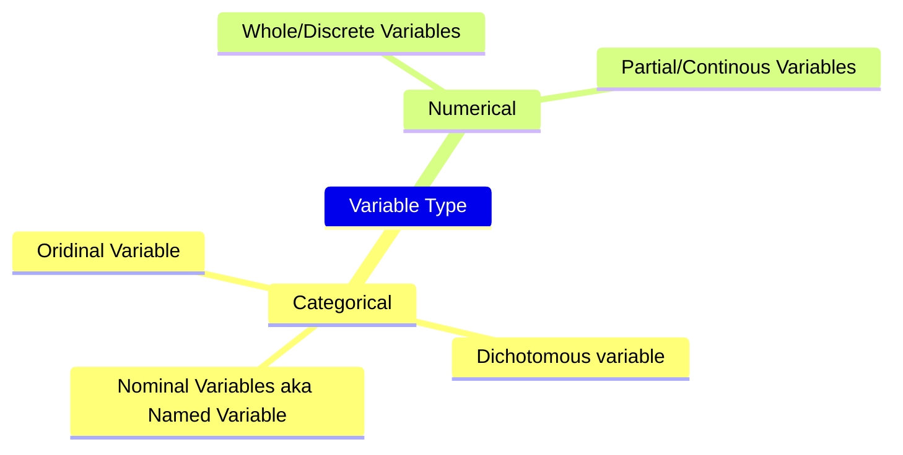
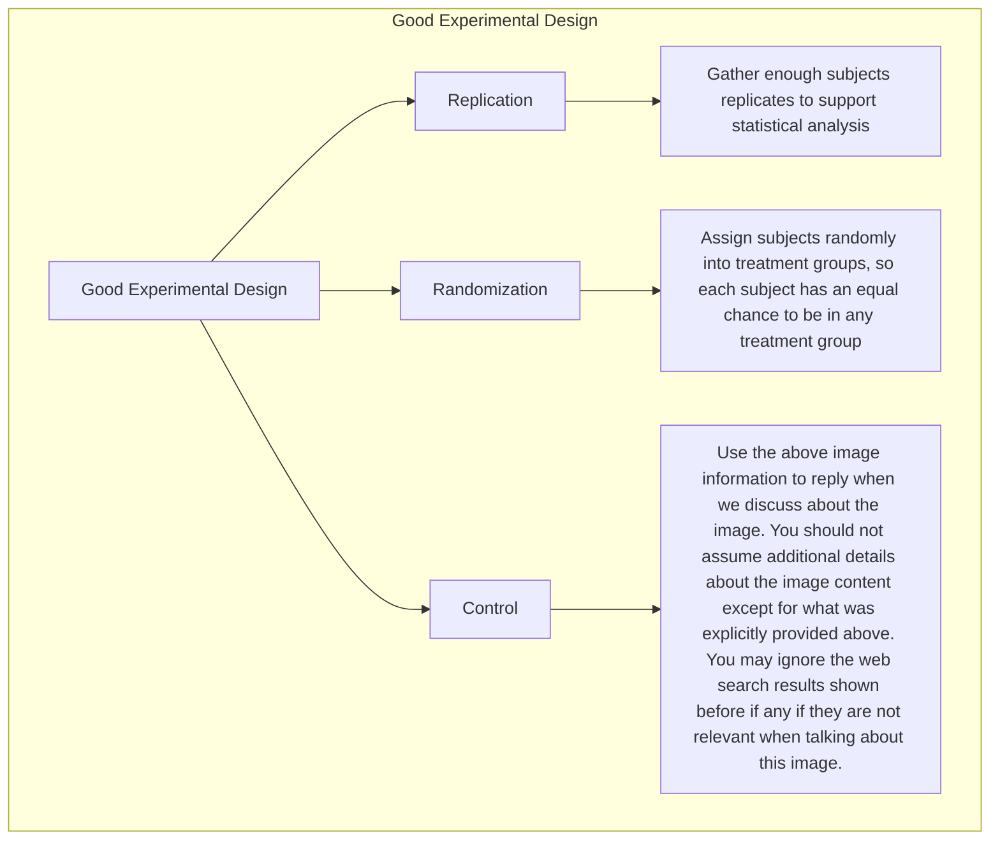

# Data Literacy Pointers
- Data Gaps: Garbage in Garbage out (Bad Data -> Great Model -> **Bad Predictions**)
- Addressing Bias:  Lack of data due to bias in society
- Visualization of data (Provide context, clarification and making sure the meaning of it is understandable)


## Statistical thinking
- Mean
- Standard Deviation
- Robust Methods : Better methods for extreme cases like skewed distribution and outliers
	- Median
	- IQR (**interquartile range**)

## Data Analysis
### Types of Data Analysis
- Descriptive analysis
- Exploratory analysis
- Inferential analysis
- Causal analysis
- Predictive analysis
### 1. Descriptive analysis
Describes, summarize and visualize data so that patterns can be recognized. It is common first step for data analysis
- Includes measures of central tendency (mean, median and mode)
- spread (e.g., range, quartiles, variance, standard deviation, distribution)
- which are referred to as descriptive or summary statistics

### 2. Exploratory analysis
We look for relationships between variable and datasets
Shows us pattern but cannot provide reasoning for it. (Correlation is not the same as causation)
- **Principal Component analysis or PCA**
- **k-means clustering**
- **Rand statistics**
### 3. Inferential Analysis
- A/B Tests are type of inferential analysis
- Used for testing hypothesis on a sample of a population.

### 4. Casual Analysis
Casual Analysis is used to test any causation *(if Exists)* for the available correlation
Causal analysis generally relies on carefully designed experiments, but we can sometimes also do causal analysis with observational data.
Experiments that support casual analysis:
- Only change one variable at a time
- Carefully control all other variable
- Repeat with multiple times with same results



> Casual Analysis with Observational Data. 
> - Performed to establish causation when actual experimentation is impossible due to being too difficult, expensive, unethical to repeat.
> - Eg: PS1: Why did a product flop? PS2: Is climate change is causing more intense hurricanes?
> #### Causal inference with observational data requires:
> - Advanced techniques to identify a causal effect
> - Meeting very strict conditions
> - Appropriate statistical tests

### 5. Predictive Analysis
One of the most common in daily life. 
Eg: Text completion, content suggestion and it also underlies computer vision.
- Uses data and supervised machine learning techniques to identify the likelihood of future outcome
- Some popular supervised machine learning techniques include **regression models**, **support vector machines**, and **deep learning convolutional neural networks**.
- It requires supplying of classified training data to train the model.

## Bias
Biases are systematic errors in thinking influenced by cultural and personal experiences.
Read more [Here](https://www.codecademy.com/paths/machine-learning-ai-engineering-foundations/tracks/mlef-principles-of-data-literacy/modules/mlef-analyzing-data/articles/bias-in-data-analysis)
## Identifying biases at different stage while analyzing data.
### 1. Bias in collecting data: 
Data collection is subject to **selection bias** (also called sample bias).
Selection bias can be due to poor study design if the sample is too small or is not randomized(aka not representative sample). 
Selection bias can also crop up when the only data available is influenced by **historical bias** — systematic influence based on historic social and cultural beliefs.
### 2. Bias in building and optimizing algorithms
**Algorithmic bias** arises when an algorithm produces systematic and repeatable errors that lead to unfair outcomes, such as privileging one group over another. Algorithmic bias can be initiated through selection bias and then reinforced and perpetuated by other bias types.
http://gendershades.org/index.html 
> [!info]  Testing an algorithm with a non-representative dataset leads to **evaluation bias**. Testing with a non-representative benchmarking dataset would give high overall accuracy scores, even if the algorithms were inaccurate for certain groups.

### 3. Bias in interpreting results and drawing conclusions
-   **Confirmation bias** leads us to favor information that supports our beliefs. To avoid this, clearly define your goals and hypotheses before analyzing data, and then honestly assess how your beliefs influenced your interpretation.
-   **Overgeneralization bias** is applying conclusions drawn from one dataset to other datasets without proper justification. To avoid this, carefully consider the limitations of your data when interpreting results and only extend them to other datasets or populations when it is appropriate.  
- **Reporting bias** is selectively reporting or sharing favorable results while omitting unfavorable ones. To combat this bias, report all results, including negative ones, and give credit to others who do the same.

# Intro to Data Acquisition
Data Acquisition or data mining.
Mention your methodology for collection of data including how variables were measured and parameter for collection (like location).
## Data sources
1. Primary Data: Collected by individual/organization who will be doing analysis.
2. Secondary Data: Collected by someone else and published for public use.

## Cleaned vs Raw data
Datasets published on kaggle are ready to used, cleaned and filtered.
Raw data offers control which can helpful whilst pre-cleaned data might disregard certain fields/rows which would have been useful.
## Data File formats
1. Tabular (csv, tsv, .xlsx)
2. Non-tabular(.tt, .rtf, .xml)\
3. image(.png, .jpg, .tif)
4. Agnodstic(.dat)

> [Refer this for more datasets](https://www.codecademy.com/paths/machine-learning-ai-engineering-foundations/tracks/mlef-python-fundamentals-for-ml-ai-engineering-partii/modules/mlef-data-acquisition/articles/intro-to-data-acquisition)
> [Harvard Dataverse](https://dataverse.harvard.edu/)

## Binomial Distribution
Binomial distributions are very useful for modeling different types of data, from drug treatment effectiveness to stock price trends. Binomial events always have 2 possible outcomes, which we refer to as _success_ and _failure_.

```python
import numpy
numpy.random.binomial(n=1, p=0.5, size=2000)   ##Returns list of outputs
## 1 flip per trial size of 2000 with a probability of 0.5
```


# What is machine learning?
## ML Vs Traditional Programming
In traditional programming, your code (rules) compiles into a binary that is typically called a program. In ML, the item that you create from the data and labels is called a _model_.


You pass the model some data and the model uses the rules that it inferred from the training to make a prediction

## Hello World Machine Learning
https://colab.research.google.com/github/lmoroney/mlday-tokyo/blob/master/Lab1-Hello-ML-World.ipynb#scrollTo=DzbtdRcZDO9B
# ML
## What is machine learning?
Computer programs that uses algorithms to analyze data and make intelligent predictions based on the data without being explicitly programmed.

## Types of Machine learning systems:
- Supervised Learning : In supervised learning; we feed the data to algorithms, in which that data are labeled and we know what our output should like having the relationship between the input values "X" and Output values "Y"
- Unsupervised Learning :  In this data is not labelled instead pattern recognition is being relied on to generate algorithms
- Reinforcement Learning :  

## Supervised Learning Vs Unsupervised Learning
### Supervised learning
1. Regression Problem : Problems which can contain continuous values. For eg: Price of mobiles can be in any range.
2. Classification problem : Problems which can contain discrete values. For eg: Brand of mobile 
- It contains input features Xs along with output features Y and there is some kind of relationship between X and Y where X is called independent feature and Y is called dependent feature. 
- Someone is supervising the data (X and Y)
