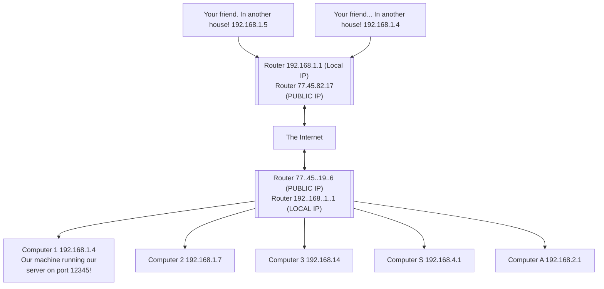

# Internet
- Global network of billions of electronic devices which acts as servers or clients.
- **Servers** are machines which provide services to other machines.
- **Clients** are machines used to connect to those services.

Q. How do we distinguish each machines?
Q. How do we transmit data

WAN (Wide Area Network): | LAN (Local Area Network)
--|--
Group of computers that span large geographic area.| Group of computers connected in limited geographic area.
Eg: Internet | Eg. Home Network, School Network

## What is IP Address?
- An IP address is a unique address that is used to identify computers or nodes on the internet.
- Addresses are in this form:   `#.#.#.#`

> [!info] Your router is the only device on the internet with this **public IP Address**
> - Inside your home, your devices have most likely received a **local IP Address** from router.
> - This local IP Address is unique on your network however, there might be other devices with same IP Address on other networks (LANs)

- IPv4:   Numbers range from `0` to `255`. IP addresses are 32-bits, meaning that these addresses could accommodate over 4 billion addresses.
- IPv6:  Newer versions of IP addresses can accommodate far more computers! IPv6
#### What is Subnet mask?
`255.255.255.0` Here 255 means that IP address amongst the devices in LAN are common where as 0 means unique to devices.
#### What is Default Gateway?
It is the Local IP Address for the router/modem that you are connected to.




### Port Address
Port Address is the address that a specific application or service runs on the given computer.
Port addresses can range from 0 to 65535. Some of them might be reserved for well know protocols and services.
#### Common Ports and Services
Port 21 - FTP File Transfer Protocol
Port 22 - SSH Secure Shell
Port 25 - SMTP Simple Mail Transfer Protocol
Port 80 - HTTP Hyper Text Transfer Protocol
Port 443 - HTTPS Hyper Text Transfer Protocol Secure

- `netstat -na` gives entire list of open ports on Windows 

>[!Warning] Port Address conflicts [todo]

## Internet Protocols

### Transmission Control Protocol
- TCP is a connection based protocol.
- Connection must be made before any data is sent.
- Used to establish a reliable, error free connection. It ensures all data was sent is received and it keeps all sent packets organized.
- For Example HTTP and HTTPS service is based on TCP Protocol

### User Datagram Protocol
- UDP is a connectionless protocol.
- No connection has to be made before sending data
- UDP tends to be faster but you may not receive the data in order and you could have missing data.

# What is a Socket?
- A socket is one endpoint of a two-way communication channel between two programs running on a network.
- A socket is a way of connecting two programs over a network so that they can exchange data. 
- When we create a socket we must specify the internet protocol and the communication protocol the socket will use.


---
------
# What is HTTP (Hyper Text Transfer Protocol)?
- It is used to structure request and responses over the internet to transfer data (html, images, css, etc) from one point to another.
- Transmission is based on TCP Protocol. TCP Manages the channels between browser and server. TCP is used to manage many different types of internet connection between devices.
- HTTP is the command language that devices on both side of the connection must follow to communicate.
## Basic Working
1. When webpage is requested using a URL. then browser opens a TCP Channel to the server that responds to that URL.
2. Once the TCP Connection is established, the client sends *HTTP GET* request to retrieve the webpage it should display.
3. After that server sends the response and closes the TCP Connection.
>This process is repeated each time the browser is opened or new URL connection needs to be established,

## In Depth Working GET Request
1. URL Requested
2. Browser extracts the protocol *http* or *https* and uses the specified.
3. Identifies the domain name from the URL and queries the Internet Domain Name Server (**DNS/Domain Name System)** to return *Internet Protocol Address*.
4. Browser, the client opens the opens a connection using the **http** protocol to the server at the IP Address resolved above.
5. Client initiates a GET Request
```
-- CLIENT GET REQUEST --
GET / HTTP/1.1
Host: www.codecademy.com
```

## HTTP vs REST (related but distinct concepts)
**HTTP (Hypertext Transfer Protocol):**
- HTTP is the foundation of any data exchange on the Web.
- It's a protocol used for transferring hypertext (text that includes links to other texts, like web pages) over the internet.
- It defines how messages are formatted and transmitted and what actions web servers and browsers should take in response to various commands.
- In simpler terms, it's the set of rules that allows your web browser to request a webpage from a server, and the server to send that webpage back to your browser as response.

**REST (Representational State Transfer):** #Guidelines 
https://www.codecademy.com/article/what-is-rest
- REST is an architectural style, a set of principles that are often applied when building web services.
- It's not a protocol like HTTP; instead, it's a set of guidelines for creating scalable and stateless web services.
- RESTful services use standard HTTP methods (like GET, POST, PUT, DELETE) for operations on resources (like data entities), and they represent these resources as URIs (Uniform Resource Identifiers).
- RESTful services typically use JSON or XML for data exchange.
- In simpler terms, REST is an approach to designing networked applications in a way that is scalable, stateless, and relies on standard HTTP methods.

> [!Info] Stateless Web Service:
>  Each request from client is independent & carries all information. So, the server doesn't store the client's state between requests and treats each requests as isolated transaction.

